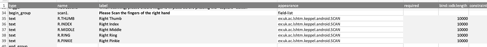

# Keppel

[](https://github.com/LSHTM-ORK/ODK_Biometrics/actions?query=workflow%3AAndroid)

[](https://github.com/LSHTM-ORK/ODK_Biometrics/actions?query=workflow%3ACLI)


This project provides a simple Android app that interfaces with mobile data collection software to allow fingerprint templates to be scanned as part of an [XLSForm](https://xlsform.org/). We also provide a second app, designed to be run on a computer workstation, which can compare two fingerprint templates and return a matching score. 


## Compatibility
This platform should work with all platforms that are based on ODK. 

| <sub>Platform</sub> | <sub>App & version</sub> | <sub>Compatibility</sub>
|-------|-----------|------------------|
|<sub>ODK</sub>|<sub>ODK Collect v2022.3</sub>|<sub>YES</sub>|
|<sub>KoBoToolbox</sub>|<sub>KoboCollect v2022.1.2</sub>|<sub>YES</sub>|
|<sub>SurveyCTO</sub>|<sub>SurveyCTO Collect v2.72</sub>|<sub>YES</sub>|
|<sub>CommCare</sub>|<sub>CommCare v8</sub>|<sub>Only with Advanced Plan or higher</sub>|
|<sub>Ona</sub>|<sub>ODK COllect v2022.3</sub>|<sub>YES</sub>


## System design

The novel biometrics system consists of two components. The first component is “Keppel”, a smartphone app designed to run on Google Android operating systems. This app provides an I/O interface between the ODK Collect app and an ANSI INCITS 378-2004 compliant electronic fingerprint reader/sensor device. The app has to be sideloaded (it isn't on play store yet).

A really important point here is that the system is not simply taking photographs of fingerprints. The data are stored as concise code which has a very 'lite' impact on the size of the data stored in ODK and also requires no use of attachments. The fingerprint data are captured as plain text that is stored and encrypted along with other ODK data.

The Keppel Smartphone app was designed using [Android Studio and Software Development Kit (SDK)](https://developer.android.com/studio). The initial version of the app works only with the low cost (<£50) Mantra MFS100 Biometric C-Type Fingerprint Scanner from [Mantra Softech Inc](www.mantratec.com), functionality for which was based on code templates provided within the [Mantra MFS100 Software Development Kit](https://download.mantratecapp.com/).

<p align="center"></p>


The app was designed with a view to making the addition of further biometric sensors relatively simple. A software ‘demo’ scanner is also included, and this allows users to test their fingerprint supported ODK forms without having a scanner connected.


## Security and Privacy

Please be aware that fingerprints (or any form of biometric data) are very sensitive personal data. Collecting them may help your programme or study but make sure to fully consider privacy and security concerns when doing so. Please consider carrying out a data protection impact assessment prior to data collection.

If you're collecting any personal information using ODK it would be a good idea to look into [encrypting forms](https://docs.opendatakit.org/encrypted-forms) and also to read ODK's [general documentation on security](https://docs.opendatakit.org/security-privacy/).


## Usage

### Install the Keppel App on your Android phone or tablet

Download the [latest release](https://github.com/LSHTM-ORK/ODK_Biometrics/releases/latest) and sideload the APK file on to your Android device

### Scanning fingerprints in ODK XLSform format

To setup a form to scan fingerprints the devices used for data collection will all need the app installed. It can be downloaded [here](https://github.com/chrissyhroberts/ODK_Fingerprints_Mantra/releases). The app integrates with ODK Collect's [External app widget](https://docs.opendatakit.org/form-question-types/#external-app-widget) using the `uk.ac.lshtm.keppel.android.SCAN` intent. An example [XML form](Example_ODK_form/form.xml) and [XLS Form](Example_ODK_form/XLS Form) are provided.

Forms should be added to your ODK system as usual, via ODK Central. 

To capture all the fingers of one hand, your XLS form would look like this.

<p align="center"></p>

The images below show how this looks in ODK Collect. Clicking 'launch' in ODK Collect opens the external app. Pressing 'capture' activates the scanner. Once the template has been captured, the data are returned to ODK Collect as plain text (N.B. Here I'm using the dummy scanner)
<p float="left">

   
   
  
   

</p>

### ODK data downloads

When you download your data CSV file from ODK Central, your fingerprint templates will be stored as plain text in line with other data from the form. From here you can either test them one at a time, or use a script to automate batch processing. 

| <sub>SubmissionDate</sub>         | <sub>ID</sub> | <sub>scan1.-R.THUMB</sub>                     |  <sub>UUID</sub>                                  |
|------------------------|----|------------------------------------|-----------------------------------------|  
|<sub>2021-12-21T18:19:36.622Z</sub>|<sub>001</sub> |<sub>464d520020323000000000f60000013c016200c500c5010000006424808b00ca7664...</sub>|<sub>uuid:4f1f19e2-846a-42d7-aef2-0574474a993b</sub>|
|<sub>2021-12-21T19:25:32.123Z</sub>|<sub>002</sub> |<sub>464d5200203230000000009c0000013c016200c500c5010000003415408c00e0874c...</sub>|<sub>uuid:2382975e-52bb-4a6b-880f-49bc5c27e787</sub>|
|<sub>2021-12-22T09:14:09.431Z</sub>|<sub>003</sub> |<sub>464d520020323000000000ae0000013c016200c500c5010000006418409200cb7b...</sub>|<sub>uuid:f7a0ab80-9d46-423a-9e64-28a0b3fb7076</sub>|
|<sub>2021-12-22T12:00:11.682Z</sub>|<sub>004</sub> |<sub>464d520020323000000000d80000013c016200c500c501000000461f807f00eed71...</sub>|<sub>uuid:9d55c0a9-901a-4908-b553-8a43a0b4037e</sub>|


### Install the Keppel CLI on your workstation 

Unzip the keppel-cli.zip. Open a terminal and do the following to copy all required applications and libraries to your /usr/local/bin folder


```console
foo@bar:~$ cd keppel-cli
foo@bar:~$ ./install.sh 
```

Test the installation with

```console
foo@bar:~$ keppel
```
you should see the help dialog

```console
foo@bar:~$ keppel

Usage: keppel [OPTIONS] COMMAND [ARGS]...

Options:
  -h, --help  Show this message and exit

Commands:
  match  Match two hex encoded ISO fingerprint templates. Threshold used for
         matching is 40.0.

```


### Matching fingerprints

To match two (hex encoded) fingerprint templates run:

```console
foo@bar:~$ keppel match /path/to/first_template /path/to/second_template

15.386568130470566
```
The core function requires that each template is stored in a single line of its own text file. The default behaviour is to return the matching score for the two templates


#### Other commands

To see available commands type 

```console
foo@bar:~$ keppel match -h
```

From version 0.3, the following options are available


**-p**         
Treats TEMPLATE_ONE and TEMPLATE_TWO as plain text rather than file
This option is very useful for scripted analysis

Example [templates truncated] 

```console
foo@bar:~$ keppel match -p 464d520020323000000001080000013c016200c500c5... 464d520020323000000000f00000013c016200c500c...

15.386568130470566
```
  
**-ms**     
Return whether templates match along with score like "match_210.124"

**-m**   
Return whether templates match (either "match" or "mismatch")

**-t FLOAT**   
Threshold (score) to be used to determine whether templates are a match or mismatch

**-h, --help** 
Show this message and exit`


## Controlling the Keppel CLI with R

[R](https://www.r-project.org/) is our favourite application for data munging, analysis and statistics. R plays nicely with system tools and can be used to control the Keppel API. .

In R, we created a very simple wrapper function that runs the Keppel CLI and returns a match score. As with any R function, this can be applied to lists, arrays and tibbles (data frames) to perform batch actions. 


```r
##########################################################################
#Define a function that gets the match score between scans.
##########################################################################

fingerprint.score<-function(print1,print2)
{

  if(!is.na(print1) & !is.na(print2)){
    c<-system(
      command = str_c("keppel match -p ",print1," ",print2),
      intern = TRUE
    )}

  if(is.na(print1) | is.na(print2)){ c<-NA}
  message(c)
  c
}
```

On an off-the-shelf MacBook Pro with 2.3 GHz 8-Core Intel Core i9 and 32 GB RAM, it took approximately 71 seconds to process 200 template matching calls sequentially. 

```R
library(furrr)
library(future)

plan(sequential)

system.time(future_map2(
  .x = df$scan1,
  .y = df$scan2,
  .f = fingerprint.score))

user     system  elapsed 
101.276  16.056  71.427 
```

>   

Called in parallel using the _**furrr**_ and _**future**_ packages, the process is much faster

```R
library(furrr)
library(future)

plan(multisession, workers = 16)
system.time(future_map2(.x = df$scan1..R.THUMB,.y = df$scan2..R.THUMB.2,.f = fingerprint.score))

user   system  elapsed 
1.261  0.059   16.467 

```
Processing n templates using the parallel approach (16 cores) took

| <sub>n</sub>   |<sub>Cores</sub>| <sub>time (s)</sub> | <sub>time/call (s)</sub> |
|----------------|----------------|---------------------|--------------------------|
|<sub>200</sub>  | <sub>1</sub>   | <sub>68.6</sub>     | <sub>0.343</sub>         |
|<sub>400</sub>  | <sub>1</sub>   | <sub>140.2</sub>    | <sub>0.350</sub>         |
|<sub>200</sub>  | <sub>16</sub>  | <sub>16.5</sub>     | <sub>0.083</sub>         |
|<sub>400</sub>  | <sub>16</sub>  | <sub>30.86</sub>    | <sub>0.077</sub>         |
|<sub>1000</sub> | <sub>16</sub>  | <sub>25.0</sub>     | <sub>0.025</sub>         | 
|<sub>2000</sub> | <sub>16</sub>  | <sub>69.7</sub>     | <sub>0.034</sub>         |
|<sub>10000</sub>| <sub>16</sub>  | <sub>773.4</sub>    | <sub>0.077</sub>         |

## Supported devices

### Mantra MFS100

#### Mantra Softech India Private Limited

* Mantra is a leading manufacturer and developer of Biometric devices, software and solutions from 2006 onwards.
* The biometric-based technology offers a dependable, helpful, and authentic way of verifying/identifying an individual's identity utilizing latest Biometric fingerprint scanner.
* Fingerprint scanners are being used broadly for enrollment, identification & verification in varied projects where the identity of people is required.
* Mantra's biometric fingerprint devices offer superior execution, accuracy, and continuance.
* Our wide ranges of fingerprint scanner devices deliver quick personality verification with a high level of security in a consistent way for various Citizen or Person identity ventures.

#### Mantra’s MFS100 - Biometric Fingerprint Scanner

* FBI and STQC certified single finger scanner MFS100 is high quality USB fingerprint sensor for fingerprint authentication in desktop or network security.
* MFS100 is based on optical sensing technology which efficiently recognizes poor quality fingerprints also.
* MFS100 can be used for authentication, identification and verification functions that let your fingerprint act like digital passwords that cannot be lost, forgotten or stolen.
* Hard optical sensor is resistant to scratches, impact, vibration and electrostatic shock.
* Lowest FAR and FRR NIST complied interoperable template format standards (ANSI378 /ISO19794-2). Compatibility with ISO 19794-4 and ISO 19794-2 for fingerprint capture and verification.
* Apart from FBI and STQC, MFS100 is CE, FCC, RoHS, WHQL, CB 60950 approved. Equivalent to FBI PIV certification.
* Supports operating system plaforms like Windows 98 SE, Me, 2000, XP, Windows7, windows vista, windows server(2003/2007/2008) and Linux.
* SDK, Libraries and drivers support across all mentioned platforms. (32 bit/64 bit) Easy integration into product servers and application support


## Why the name? 

This project was created by researchers at the London School of Hygiene & Tropical Medicine. Our mission is to improve health and health equity in the UK and worldwide; working in partnership to achieve excellence in public and global health research, education and translation of knowledge into policy and practice. LSHTM's main building is situated on Keppel Street in London's Bloomsbury district. The Keppel App and CLI are named after the street where you will find us and not after any (no doubt problematic) historical figures who may have given their name to the street.


## Funding & Ethics

This work was funded by the UK Department of Health and Social Care using UK Aid funding managed by the NIHR (PR-OD-1017-20001). Ethical permission for elements of the work that handled fingerprint templates from living humans was granted by the London School of Hygiene & Tropical Medicine Observational Research Ethics Committee (Ref. 22562).

<p float="left">
   
  
</p>

## Development

See [DEVELOPMENT.md].
